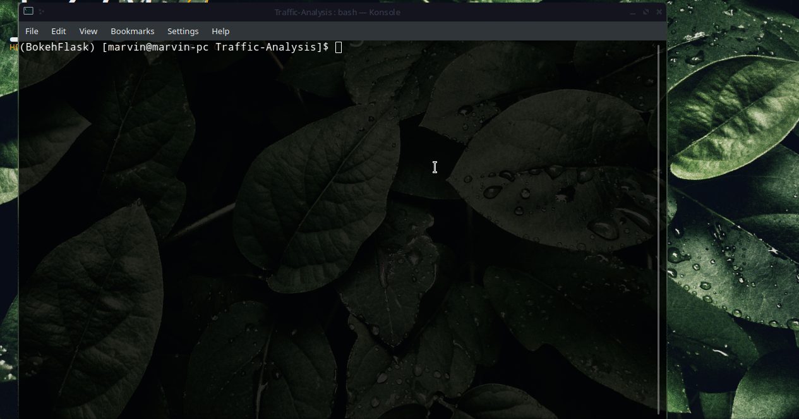

# TufikeKwetu

   

> A display of traffic fatalities over a period of 20 years in Australia.

Description
-----------
Over the past 16 years, starting 2002, a number of road accidents have been reported and duly recorded.
This EDA, is meant to look into the data and uncover possible findings in a bid to learn from it and possibly curb future repetition .

We compare cumulative road accidents among other things on year , month and state.

You can [try it out](https://traffic-analysis-display.herokuapp.com/?item_for_compare=Year) yourself. :wink:

## Setup

## Roadmap

- Add more aspects of data exploration.
- Allow scraping.
